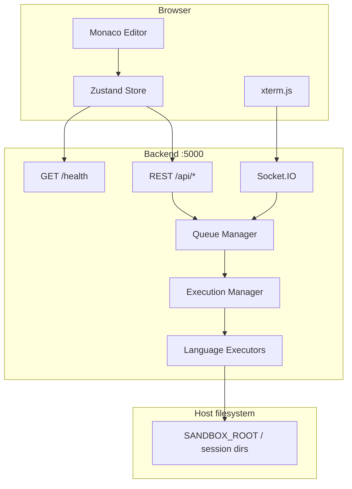
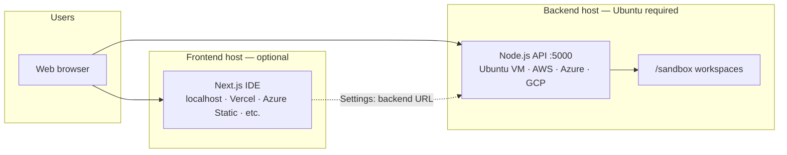
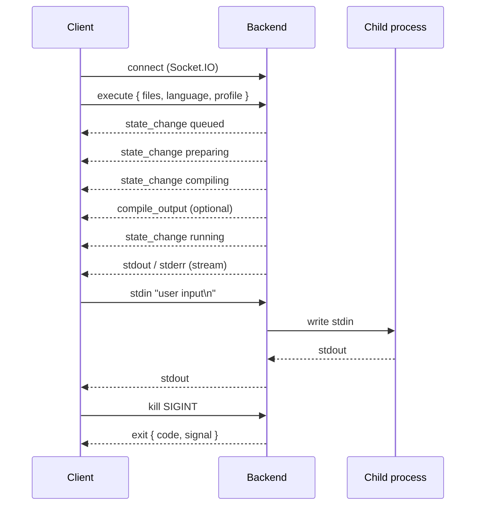
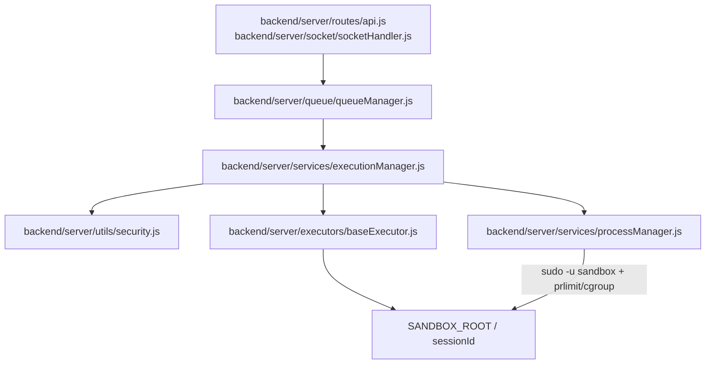

# Sandphiler

[](https://nodejs.org/)
[](https://nextjs.org/)
[](https://socket.io/)

**Sandphiler** is a production-oriented sandboxed online compiler platform: a browser IDE (Monaco + xterm.js) paired with a Node.js execution server that compiles and runs untrusted code in isolated per-session workspaces.

The **backend is built specifically for Ubuntu** (22.04 LTS or 24.04 LTS). It relies on Ubuntu packages (`apt`), `prlimit`, the `sandbox` system user, and [backend/setup.sh](backend/setup.sh)—which targets Ubuntu only. Host it on a **local Ubuntu VM**, an **on-prem Ubuntu server**, or an **Ubuntu cloud instance** (AWS EC2 Ubuntu AMI, Azure Ubuntu VM, Google Compute Engine with Ubuntu, DigitalOcean, etc.). The **frontend can run on any OS** (Windows, macOS, Linux, or hosted static/Node platforms) and connects to the Ubuntu backend over HTTP/WebSocket via Settings.

This document is the **canonical reference** for operators and integrators. Component-specific guides live in [frontend/README.md](frontend/README.md) and [backend/README.md](backend/README.md).

---

## Table of contents

1. [Overview](#overview)
2. [Architecture](#architecture)
3. [Hosting & cloud deployment](#hosting--cloud-deployment)
4. [Supported languages](#supported-languages)
5. [Quick start](#quick-start)
6. [Configuration](#configuration)
7. [Execution profiles](#execution-profiles)
8. [API reference](#api-reference)
9. [Socket.IO protocol](#socketio-protocol)
10. [Execution lifecycle](#execution-lifecycle)
11. [Client integration](#client-integration)
12. [Production deployment](#production-deployment)
13. [Security](#security)
14. [Monitoring & troubleshooting](#monitoring--troubleshooting)
15. [Development](#development)

---

## Overview

| Layer | Stack | Default port | Typical host |
|-------|--------|--------------|--------------|
| **Frontend** | Next.js 16, TypeScript, Tailwind, Zustand, Monaco, xterm.js | `3000` | Local dev, Vercel, any static/Node host |
| **Backend** | Node.js, Express, Socket.IO, Winston | `5000` | **Ubuntu 22.04/24.04** (VM, AWS, Azure, GCP, VPS) |

**Typical flow**

1. User edits code in the web IDE and clicks **Run**.
2. Frontend opens a Socket.IO connection to the backend and emits `execute` with source files.
3. Backend enqueues the job, writes files under `SANDBOX_ROOT/<sessionId>/`, compiles if needed, spawns the process under resource limits, and streams `stdout` / `stderr`.
4. User types in the terminal; input is forwarded via `stdin`. **Stop** sends `kill` (`SIGINT`).

For batch/automation use cases, `POST /api/run` returns the full output when the run finishes (no WebSocket required).

---

## Architecture



**REST vs WebSocket**

| Mode | Endpoint / transport | Use when |
|------|----------------------|----------|
| **Interactive** | Socket.IO `execute` + stream events | IDE terminal, stdin programs, live compile output |
| **Batch** | `POST /api/run` | CI scripts, one-shot runs, no terminal UI |

**Deployment split**: only the **backend** must be **Ubuntu** with compilers installed via `setup.sh` or `apt`. The **frontend** has no OS requirement and can be hosted separately.

---

## Hosting & cloud deployment

Sandphiler uses a **split deployment model**: the compiler backend and the web IDE do not need to run on the same machine.



### Where to run each component

| Component | Runs on | Examples |
|-----------|---------|----------|
| **Backend** | **Ubuntu 22.04 or 24.04 LTS only** | VMware/VirtualBox Ubuntu VM, Proxmox, bare metal, **AWS EC2** (Ubuntu AMI), **Azure VM** (Ubuntu), **GCE** (Ubuntu image), DigitalOcean/Linode/Hetzner Ubuntu droplets |
| **Frontend** | Any OS / any Node-capable host | Windows/macOS/Linux dev machine, Vercel, Netlify, Azure App Service, optional second VM |

Point the IDE at your backend using **Settings → VM IP / host + port** (e.g. `203.0.113.10:5000` or `https://compiler-api.yourdomain.com` behind a reverse proxy).

### Supported backend hosts (Ubuntu only)

The backend is **not tied to one cloud vendor**, but it **is tied to Ubuntu**. Use **Ubuntu 22.04 LTS or 24.04 LTS** on every backend host. Other distributions (Debian, RHEL, Alpine, Amazon Linux) are **not supported**—`setup.sh`, runtime paths, and `prlimit`/`sudo` sandboxing are written for Ubuntu.

| Provider | Typical service | Ubuntu image |
|----------|-----------------|--------------|
| **On-prem / lab** | VMware, Hyper-V, VirtualBox, Proxmox | Ubuntu Server 22.04/24.04 ISO; use LAN IP in Settings (re-test after DHCP changes) |
| **Amazon Web Services** | EC2, Lightsail | **Ubuntu Server AMI** (not Amazon Linux); security group for `5000` or `443`; Elastic IP |
| **Microsoft Azure** | Virtual Machines | **Ubuntu LTS** marketplace image; NSG for API port |
| **Google Cloud** | Compute Engine | **Ubuntu** boot image; `e2-medium`+; firewall `tcp:5000` or HTTPS LB |
| **Other VPS** | DigitalOcean, Linode, Hetzner, Oracle | One-click **Ubuntu 22.04/24.04** droplet → `setup.sh` → systemd |

> **Why Ubuntu?** Compiler install scripts use `apt` and `snap` (Kotlin), sandbox user setup matches Ubuntu’s `adduser`/`sudoers.d` layout, and production hardening docs assume `systemd` on Ubuntu Server.

| Platform | Backend support |
|----------|-----------------|
| **Ubuntu 22.04 / 24.04** | ✅ Full support (production) |
| **Windows / macOS** | ⚠️ Dev-only (`USE_SUDO=false`, no real sandbox)—not for production |
| **Other Linux distros** | ❌ Not supported—use Ubuntu instead |

### Network requirements

| Requirement | Detail |
|-------------|--------|
| **Inbound** | Clients must reach backend `PORT` (default `5000`) for REST **and** Socket.IO (WebSocket upgrade) |
| **Outbound** | Backend needs outbound access only if you install runtimes via `apt`/`curl` (setup); user code egress is not filtered by default |
| **TLS** | Recommended in production: terminate HTTPS at nginx, Caddy, AWS ALB, or Azure Application Gateway |
| **CORS** | Backend allows `*` today; restrict at the proxy or add auth before public exposure |

### Quick cloud setup (any provider)

1. Launch an **Ubuntu 22.04/24.04** VM with at least **2 vCPU / 4 GB RAM** (more for heavy Rust/Java compile load).
2. SSH in, clone/copy `sandphiler/backend`, run `./setup.sh`, configure `.env`, start with **systemd** (see [Production deployment](#production-deployment)).
3. Assign a **stable endpoint**: Elastic IP (AWS), static public IP (Azure/GCP), or DNS `A` record.
4. Open the firewall / security group for your API port (or `443` only if using a reverse proxy).
5. On your dev machine or hosted frontend: **Settings →** enter `http://<public-ip>:5000` or `https://compiler-api.example.com` → **Test Server** → **Save**.

### Frontend + backend placement patterns

| Pattern | Backend | Frontend | Best for |
|---------|---------|----------|----------|
| **Local dev** | `localhost:5000` or LAN VM IP | `localhost:3000` | Development |
| **Cloud API, local UI** | AWS/Azure/GCP VM | Developer laptop | Team testing against shared runner |
| **Full cloud** | EC2 / Azure VM / GCE | Vercel / Netlify / App Service | Production demos |
| **Same VM** | `:5000` | `:3000` on same instance | Simple single-server deploy |

`REMOTE_VM_ENABLED` and `REMOTE_VM_POOL` in `.env` are reserved for routing work across **multiple** backend instances later; a single VM or cloud instance is the standard setup today.

---

## Supported languages

| Language | `language` value | Toolchain |
|----------|------------------|-----------|
| Python 3 | `python` | `python3` |
| JavaScript | `javascript` | `node` |
| TypeScript | `typescript` | `tsc` → `node` |
| C | `c` | `gcc` |
| C++ | `cpp` | `g++` |
| Java | `java` | `javac` / `java` |
| Go | `go` | `go` |
| Rust | `rust` | `rustc` |
| Kotlin | `kotlin` | `kotlinc` |
| PHP | `php` | `php` |
| Ruby | `ruby` | `ruby` |
| C# | `csharp` | `mcs` / `mono` |

If `language` is omitted, the backend infers it from the main filename extension or code patterns (`languageDetector.js`).

**Runtime availability** is probed at server startup and exposed via `GET /api/languages`. Unavailable runtimes return HTTP `422` on `POST /api/run`.

---

## Quick start

### Backend (Ubuntu required for production)

On your **Ubuntu 22.04/24.04** server or VM:

```bash
cd backend
npm install
cp .env.example .env
npm start
```

```bash
curl -s http://localhost:5000/health | jq
```

**Ubuntu production bootstrap** (compilers + `sandbox` user):

```bash
cd backend
chmod +x setup.sh
./setup.sh
```

Set production `.env`:

```env
PORT=5000
NODE_ENV=production
SANDBOX_ROOT=/sandbox
USE_SUDO=true
SANDBOX_USER=sandbox
DEFAULT_PROFILE=interactive-terminal
```

### Frontend

```bash
cd frontend
npm install
npm run dev
```

Open `http://localhost:3000` → **Settings** → set host/port → **Test Server** → **Save** → **Run Code**.

### Remote backend (VM or cloud)

Use this when the compiler runs on a **separate Ubuntu VM or Ubuntu cloud instance** (AWS EC2 Ubuntu AMI, Azure Ubuntu VM, GCP Ubuntu, home lab Ubuntu VM, etc.) and the IDE runs on your PC or another host.

1. Deploy the backend on the remote host (see [Hosting & cloud deployment](#hosting--cloud-deployment) and [Production deployment](#production-deployment)).
2. Note the instance **public IP** or DNS name and ensure port **5000** (or your proxy port) is reachable from your network.
3. In the Sandphiler UI: **Settings → VM IP Address** = public IP or hostname, **Port** = `5000` (or `443` if TLS terminates at the proxy without path rewriting issues).
4. **Test Server** must return `✓ Server Connection Successful!` before **Save**.
5. Run code — Socket.IO and REST both use the saved `backendUrl` (e.g. `http://203.0.113.50:5000`).

```bash
# Verify from your workstation before configuring the UI
curl -s http://<PUBLIC_IP>:5000/health
```

If the health check works in the terminal but fails in the browser, check **browser mixed content** (`https` frontend calling `http` backend) and cloud **security group / NSG / firewall** rules.

### Windows local dev (backend only — not supported for production)

For API testing on Windows only (no Ubuntu sandbox, no `sudo` drop):

```env
SANDBOX_ROOT=./sandbox
USE_SUDO=false
NODE_ENV=development
```

Production and real code execution must run on **Ubuntu** as described above.

---

## Configuration

Copy [backend/.env.example](backend/.env.example) to `backend/.env`.

| Variable | Default | Description |
|----------|---------|-------------|
| `PORT` | `5000` | HTTP + Socket.IO listen port |
| `NODE_ENV` | `development` | Logged in `/health`; use `production` in deploy |
| `SANDBOX_ROOT` | `backend/sandbox` (resolved) | Ephemeral workspace root |
| `USE_SUDO` | `false` (forced off on Windows) | Spawn as `SANDBOX_USER` via `sudo -u` |
| `SANDBOX_USER` | `sandbox` | Unprivileged Ubuntu system user for code execution |
| `MAX_CONCURRENT_EXECUTIONS` | `10` | Active runs cap |
| `QUEUE_TIMEOUT_MS` | `30000` | Max wait in queue before rejection |
| `CLEANUP_INTERVAL_MS` | `60000` | Stale workspace sweep interval |
| `STALE_THRESHOLD_MS` | `300000` | Age before workspace considered stale |
| `DEFAULT_PROFILE` | `interactive-terminal` | Profile when request omits `profile` |
| `REMOTE_VM_ENABLED` | `false` | Reserved for multi-VM routing |
| `REMOTE_VM_POOL` | _(empty)_ | Comma-separated backend URLs |

**Global output limits** (`backend/server/config/config.js`): **5 MB** stdout/stderr cap per session is enforced in `processManager.js`. (`throttleMs` / `maxLinesPerSecond` are defined but not wired yet.)

---

## Execution profiles

Profiles map to Ubuntu `prlimit` constraints and a Node-side wall-clock timeout.

| Profile | CPU (s) | Memory | Max processes | Max file | Wall timeout |
|---------|---------|--------|---------------|----------|--------------|
| `competitive-programming` | 2 | 64 MB | 10 | 1 MB | 3 s |
| `quick-execution` | 1 | 32 MB | 5 | 512 KB | 1.5 s |
| `restricted-mode` | 5 | 16 MB | 2 | 64 KB | 10 s |
| `interactive-terminal` | 300 | 256 MB | 30 | 10 MB | 5 min |
| `high-memory` | 30 | 1 GB | 50 | 50 MB | 45 s |

Unknown profile names fall back to `interactive-terminal`.

---

## API reference

### Base URL and transport

| Item | Value |
|------|--------|
| **Base URL** | `http://<host>:<PORT>` (default `http://localhost:5000`) |
| **REST prefix** | `/api` |
| **Health** | `GET /health` (no `/api` prefix) |
| **Socket.IO** | Same origin as REST; path `/socket.io/` (default Engine.IO) |
| **CORS** | `origin: *` on REST and Socket.IO (tighten behind reverse proxy in production) |
| **Request body** | `Content-Type: application/json` for POST routes |

There is **no authentication** in the current API. Treat the backend as a privileged internal service.

### Common types

#### `CodeFile`

| Field | Type | Required | Description |
|-------|------|----------|-------------|
| `name` | `string` | yes | Filename (sanitized: alphanumeric, `_`, `-`, `.`; no path traversal) |
| `content` | `string` | yes | Source code |

#### `priority` (queue)

| Value | Behavior |
|-------|----------|
| `high` | Jump ahead of `normal` and `low` |
| `normal` | Default FIFO among normal jobs |
| `low` | Processed after normal and high |

#### Error envelope (REST)

Failed requests generally return:

```json
{
  "error": "Human-readable message",
  "sessionId": "optional-uuid"
}
```

---

### `GET /health`

Liveness probe used by the frontend settings modal.

**Response** `200 OK`

```json
{
  "status": "healthy",
  "timestamp": 1716300000000,
  "env": "production",
  "platform": "linux"
}
```

**Example**

```bash
curl -s http://localhost:5000/health
```

---

### `GET /api/languages`

Lists all supported languages with live install detection from server startup probing.

**Response** `200 OK`

```json
{
  "languages": [
    {
      "language": "python",
      "label": "Python 3",
      "available": true,
      "version": "Python 3.12.3",
      "compilerPath": null,
      "runtimePath": "/usr/bin/python3",
      "installHint": null
    },
    {
      "language": "kotlin",
      "label": "Kotlin (kotlinc)",
      "available": false,
      "version": null,
      "compilerPath": null,
      "runtimePath": null,
      "installHint": "sudo snap install --classic kotlin"
    }
  ]
}
```

| Field | Description |
|-------|-------------|
| `available` | `true` if compiler/runtime resolved on this host |
| `compilerPath` | Resolved compiler binary (if applicable) |
| `runtimePath` | Resolved interpreter/runtime binary |
| `installHint` | Ubuntu install hint when `available` is `false` |

---

### `POST /api/run`

Runs code synchronously from the caller’s perspective: the HTTP response is sent when the execution reaches a terminal state (`completed`, `timeout`, `killed`, or `crashed`).

**Request body**

| Field | Type | Required | Description |
|-------|------|----------|-------------|
| `files` | `CodeFile[]` | yes | One or more source files |
| `language` | `string` | recommended | Language id (see table above) |
| `mainFilename` | `string` | no | Entry file; defaults to first file |
| `profile` | `string` | no | Execution profile (default from `DEFAULT_PROFILE`) |
| `priority` | `string` | no | `high` \| `normal` \| `low` (default `normal`) |
| `sessionId` | `string` (UUID) | no | Client-supplied id; auto-generated if omitted |

**Success response** `200 OK`

```json
{
  "sessionId": "46fae8dc-37ea-4d83-bc27-7cf4c211fca3",
  "success": true,
  "state": "completed",
  "durationMs": 420,
  "compileOutput": "",
  "stdout": "Hello world!\n",
  "stderr": "",
  "error": null
}
```

| Field | Description |
|-------|-------------|
| `success` | `true` only when `state === "completed"` |
| `state` | Terminal execution state (see [Execution lifecycle](#execution-lifecycle)) |
| `durationMs` | Wall time from queue to terminal state |
| `compileOutput` | Aggregated compiler diagnostics |
| `stdout` / `stderr` | Captured process streams (non-interactive) |

**Error responses**

| Status | Condition |
|--------|-----------|
| `400` | Missing `files`, execution failed in early phase, or queue/executor error |
| `422` | Language not installed on server |
| `500` | Internal queue or execution failure |

**422 example**

```json
{
  "sessionId": "46fae8dc-37ea-4d83-bc27-7cf4c211fca3",
  "success": false,
  "error": "Runtime 'kotlin' is not installed on this server. Install with: sudo snap install --classic kotlin"
}
```

**Examples**

Python:

```bash
curl -s -X POST http://localhost:5000/api/run \
  -H "Content-Type: application/json" \
  -d '{
    "language": "python",
    "profile": "quick-execution",
    "files": [
      {
        "name": "main.py",
        "content": "print(sum(range(10)))"
      }
    ]
  }'
```

C++ (competitive profile):

```bash
curl -s -X POST http://localhost:5000/api/run \
  -H "Content-Type: application/json" \
  -d '{
    "language": "cpp",
    "profile": "competitive-programming",
    "priority": "high",
    "files": [
      {
        "name": "main.cpp",
        "content": "#include <iostream>\nint main(){ std::cout << 42; }"
      }
    ]
  }'
```

---

### `POST /api/stop`

Stops a running process or removes a queued session.

**Request body**

| Field | Type | Required |
|-------|------|----------|
| `sessionId` | `string` | yes |

**Responses**

| Status | Body | Meaning |
|--------|------|---------|
| `200` | `{ "sessionId": "...", "status": "termination_signal_sent" }` | `SIGKILL` sent to active child |
| `200` | `{ "sessionId": "...", "status": "removed_from_queue" }` | Job removed before start |
| `400` | `{ "error": "sessionId is required" }` | Missing id |
| `404` | `{ "sessionId": "...", "error": "Active process or queued session not found" }` | Unknown session |

**Example**

```bash
curl -s -X POST http://localhost:5000/api/stop \
  -H "Content-Type: application/json" \
  -d '{"sessionId": "46fae8dc-37ea-4d83-bc27-7cf4c211fca3"}'
```

---

### `GET /api/stats`

Operational metrics for dashboards and capacity planning.

**Response** `200 OK`

```json
{
  "timestamp": 1716300000000,
  "system": {
    "platform": "linux",
    "uptimeSeconds": 86400,
    "cpu": {
      "cores": 4,
      "loadAvg": [0.42, 0.38, 0.35],
      "usagePercent": 11
    },
    "memory": {
      "totalMb": 8192,
      "usedMb": 2048,
      "freeMb": 6144,
      "usagePercent": 25
    }
  },
  "sandbox": {
    "disk": {
      "sizeMb": 12.5,
      "fileCount": 340
    },
    "activeSessions": 2,
    "queue": {
      "activeCount": 2,
      "queuedCount": 1,
      "maxConcurrent": 10
    }
  },
  "processes": [
    {
      "sessionId": "abc-123",
      "stats": {
        "pid": 44120,
        "cpuPercent": 12.5,
        "memoryMb": 48.2,
        "elapsedSeconds": 3
      }
    }
  ]
}
```

**Example**

```bash
curl -s http://localhost:5000/api/stats | jq
```

---

## Socket.IO protocol

Connect with the [Socket.IO client](https://socket.io/docs/v4/client-api/) to the same base URL as REST (e.g. `http://192.168.1.10:5000`).

```javascript
import { io } from 'socket.io-client';

const socket = io('http://localhost:5000', {
  reconnectionAttempts: 5,
  timeout: 10000
});
```

### Client → server events

| Event | Payload | Description |
|-------|---------|-------------|
| `ping` | _(none)_ | Optional heartbeat; server replies `pong` |
| `execute` | See below | Start new run or reconnect to existing `sessionId` |
| `stdin` | `string` | Write to active process stdin (append `\n` for line-oriented programs) |
| `kill` | `string` (optional) | Default `'SIGINT'`; forwarded to process manager |
| `resize` | `{ cols: number, rows: number }` | PTY resize stub; server acks with `resize_ack` |

#### `execute` payload

| Field | Type | Required | Description |
|-------|------|----------|-------------|
| `files` | `CodeFile[]` | yes | Source files |
| `language` | `string` | recommended | Language id |
| `mainFilename` | `string` | no | Entry file |
| `profile` | `string` | no | Default `interactive-terminal` in IDE |
| `priority` | `string` | no | Queue priority |
| `sessionId` | `string` | no | Reconnect to in-flight session |

**New execution example**

```javascript
socket.emit('execute', {
  language: 'python',
  profile: 'interactive-terminal',
  priority: 'normal',
  files: [
    { name: 'main.py', content: 'name = input("Name? ")\nprint(f"Hi {name}")' }
  ]
});
```

**Reconnect**: emit `execute` with the same `sessionId` while the session still exists in `sessionStore`. Server emits `execution_sync` and replays buffered `stdout`/`stderr` history.

### Server → client events

| Event | Payload | Description |
|-------|---------|-------------|
| `pong` | _(none)_ | Reply to `ping` |
| `state_change` | `{ state: string, ...meta }` | Lifecycle update (includes `queued` from queue) |
| `compile_output` | `string` | Compiler stdout/stderr chunk |
| `stdout` | `string` | Runtime stdout chunk |
| `stderr` | `string` | Runtime stderr chunk |
| `exit` | `{ code: number, signal: string \| null }` | Process exited; session removed from store |
| `execution_sync` | `{ sessionId, state, language, profileName }` | Reconnect handshake |
| `execution_error` | `string` | Queue failure, unsupported language, or executor error |
| `resize_ack` | `{ cols, rows }` | Resize stub acknowledgment |

### Interactive sequence



### Disconnect behavior

If the browser disconnects, the backend **keeps the session alive** for a grace period (socket reference cleared, `disconnectedAt` set). Reconnect with the same `sessionId` to resume streaming and replay terminal history.

---

## Execution lifecycle

Valid states (server-side `ExecutionStateManager`):

```text
queued → preparing → compiling → running → completed
                                      ↘ timeout
                                      ↘ killed
                                      ↘ crashed
                                      → cleanup
```

| State | Meaning |
|-------|---------|
| `queued` | Waiting for a free execution slot |
| `preparing` | Writing files to sandbox directory |
| `compiling` | Compiler invoked (C/C++/Java/Rust/TS/etc.) |
| `running` | Child process active |
| `completed` | Exited with success (exit code 0) |
| `timeout` | Wall-clock or CPU limit exceeded |
| `killed` | Stopped via `kill` / `POST /api/stop` |
| `crashed` | Compile failure or unhandled executor error |
| `cleanup` | Workspace teardown (internal) |

---

## Client integration

### Sandphiler web IDE

| Concern | Implementation |
|---------|----------------|
| Backend URL | `useStore.backendUrl`, persisted in `localStorage` key `compiler_backend_url` |
| Health check | `GET {backendUrl}/health` — expects `status === "healthy"` |
| Run | Custom event `compiler_trigger_run` → Socket `execute` |
| Stop | `compiler_trigger_kill` → Socket `kill` (`SIGINT`) |
| Terminal input | xterm `onData` → Socket `stdin` (line buffered with `\n`) |

Default backend URL in store: `http://43.204.130.188:5000` — **change via Settings** for your environment.

### Minimal third-party client

```javascript
// 1. Batch run (no WebSocket)
const res = await fetch('http://localhost:5000/api/run', {
  method: 'POST',
  headers: { 'Content-Type': 'application/json' },
  body: JSON.stringify({
    language: 'javascript',
    files: [{ name: 'main.js', content: 'console.log("ok")' }]
  })
});
const result = await res.json();

// 2. Interactive (Socket.IO)
const socket = io('http://localhost:5000');
socket.on('stdout', (chunk) => process.stdout.write(chunk));
socket.on('exit', console.log);
socket.emit('execute', {
  language: 'python',
  profile: 'interactive-terminal',
  files: [{ name: 'main.py', content: 'print(input())' }]
});
```

---

## Production deployment

Deploy the **backend on a dedicated Ubuntu Server VM or Ubuntu cloud instance**. All install and sandbox steps assume **Ubuntu 22.04/24.04 LTS**. The flow is the same on-prem or on AWS, Azure, GCP, or a VPS—only firewall and IP/DNS differ by provider.

**Do not** deploy the production backend on Amazon Linux, RHEL, Debian-only images, or Windows Server; use an **Ubuntu** image/marketplace SKU every time.

### 0. Cloud & VM checklist (AWS, Azure, GCP, VPS)

| Step | AWS | Azure | GCP | Generic VPS |
|------|-----|-------|-----|-------------|
| OS image | Ubuntu 22.04/24.04 LTS AMI | Ubuntu LTS on VM | Ubuntu LTS on Compute Engine | Provider Ubuntu image |
| Instance size | `t3.medium`+ (compile-heavy: `t3.large`) | B2s+ or D2s_v3+ | `e2-medium`+ | 2 vCPU / 4 GB RAM minimum |
| Stable IP | Elastic IP → associate to EC2 | Static public IP on NIC | Reserve external IP | Provider floating IP |
| Firewall | Security group: inbound `5000` or `443` | NSG: allow API port | VPC firewall: `tcp:5000` | Provider firewall / ufw |
| SSH access | Key pair + `ssh ubuntu@<eip>` | SSH key + public IP | `gcloud compute ssh` | Provider console / SSH |
| Install stack | `git clone` → `backend/setup.sh` | Same | Same | Same |
| Process manager | systemd (below) | systemd | systemd | systemd |
| HTTPS (optional) | ALB + ACM, or nginx on instance | App Gateway / nginx | HTTPS LB / nginx | Caddy / nginx + Let’s Encrypt |

After the instance is up, continue with Ubuntu hardening and systemd on that host—**the application install is identical** regardless of cloud vendor.

**Example: AWS EC2 security group (inbound)**

| Type | Port | Source | Purpose |
|------|------|--------|---------|
| SSH | 22 | Your IP | Administration |
| Custom TCP | 5000 | Frontend users / `0.0.0.0/0` * | Sandphiler API + WebSocket |
| HTTPS | 443 | `0.0.0.0/0` | Optional reverse proxy |

\* Restrict `5000`/`443` to known IPs in production; use a VPN or auth gateway when possible.

**Example: Azure NSG**

Add an inbound rule: **Destination port** `5000`, **Protocol** TCP, **Source** as needed (or front with Application Gateway on `443`).

### 1. Ubuntu host hardening

Run [backend/setup.sh](backend/setup.sh) or install runtimes manually (see [backend/README.md](backend/README.md)).

**Sandbox user & sudoers** (required when `USE_SUDO=true`):

```bash
sudo useradd -r -s /bin/false -M sandbox
sudo mkdir -p /sandbox
sudo chown -R <node_user>:<node_user> /sandbox
```

```text
# /etc/sudoers.d/sandphiler-sandbox
<node_user> ALL=(sandbox) NOPASSWD: ALL
```

### 2. systemd service

```ini
# /etc/systemd/system/sandphiler-backend.service
[Unit]
Description=Sandphiler Compiler Backend
After=network.target

[Service]
Type=simple
User=ubuntu
WorkingDirectory=/opt/sandphiler/backend
ExecStart=/usr/bin/node server.js
Restart=always
RestartSec=5
Environment=NODE_ENV=production
Environment=PORT=5000
Environment=SANDBOX_ROOT=/sandbox
Environment=USE_SUDO=true
Environment=SANDBOX_USER=sandbox
Environment=MAX_CONCURRENT_EXECUTIONS=10

[Install]
WantedBy=multi-user.target
```

```bash
sudo systemctl daemon-reload
sudo systemctl enable sandphiler-backend
sudo systemctl start sandphiler-backend
```

### 3. Reverse proxy (recommended)

Place TLS and rate limiting in front of the backend; restrict CORS to your frontend origin.

```nginx
# Example: compiler-api.example.com → backend:5000
upstream sandphiler_backend {
    server 127.0.0.1:5000;
}

server {
    listen 443 ssl;
    server_name compiler-api.example.com;

    location / {
        proxy_pass http://sandphiler_backend;
        proxy_http_version 1.1;
        proxy_set_header Upgrade $http_upgrade;
        proxy_set_header Connection "upgrade";
        proxy_set_header Host $host;
        proxy_set_header X-Real-IP $remote_addr;
        proxy_read_timeout 300s;
    }
}
```

Socket.IO requires WebSocket upgrade headers (`Upgrade`, `Connection`).

### 4. Frontend production build

```bash
cd frontend
npm run build
npm run start   # or deploy to Vercel/static host with NEXT_PUBLIC_* backend URL
```

Set the IDE backend URL in **Settings** to your public API origin (`https://compiler-api.example.com`).

### 5. Multi-region & scaling notes

- **Single VM / single cloud instance** is the default and simplest setup.
- For **multiple backends**, deploy independent VMs (e.g. one EC2 per region) and point different user groups to different URLs in Settings, or use `REMOTE_VM_POOL` when multi-VM routing is enabled in a future release.
- Prefer **one compiler host per untrusted tenant tier** rather than sharing one VM across unrelated customers without extra isolation (containers/Kata, gVisor, etc.).

### 6. Production checklist

- [ ] Backend on **Ubuntu 22.04/24.04** VM or cloud instance (official Ubuntu AMI/image—not Amazon Linux or Windows)
- [ ] Cloud **security group / NSG / firewall** allows API port from frontend users only
- [ ] **Elastic/static IP** or DNS record documented for IDE Settings
- [ ] Backend not exposed without TLS, firewall, and auth gateway
- [ ] Dedicated VM/container; no co-located sensitive data
- [ ] `USE_SUDO=true`, `SANDBOX_USER=sandbox`, `verifySandboxUser` passes (`backend/setup.sh` + sudoers)
- [ ] Execution profiles in `backend/server/config/profiles.js` reviewed for your workload
- [ ] `MAX_CONCURRENT_EXECUTIONS` tuned to CPU/RAM
- [ ] Log rotation under `backend/logs/` (Winston daily rotate)
- [ ] Monitor `GET /api/stats` and host metrics
- [ ] Periodic VM snapshot or rebuild policy for compromise recovery

---

## Security

The compiler backend executes **untrusted user code**. All controls below are implemented under the **`backend/`** package (Ubuntu production with `USE_SUDO=true`). This section documents what the backend actually does—see source files for exact behavior.

### Security module map (`backend/`)

| Area | Source path | Role |
|------|-------------|------|
| Input & path hardening | `backend/server/utils/security.js` | Filename sanitization, path containment, fork-bomb pattern block, command block/allow lists |
| Sandbox config | `backend/server/config/config.js` | `SANDBOX_ROOT`, `USE_SUDO`, `SANDBOX_USER`, output byte cap |
| Resource profiles | `backend/server/config/profiles.js` | CPU, memory, process count, file size, wall-clock timeout → `prlimit` / cgroups |
| Workspace lifecycle | `backend/server/executors/baseExecutor.js` | Per-session dir, file writes, output path redaction, cleanup |
| Privileged spawn | `backend/server/services/processManager.js` | `sudo` drop, `prlimit`, cgroups v2, timeouts, output kill, process groups |
| Compile/helper spawn | `backend/server/utils/secureSpawn.js` | Same `sudo` + env isolation for compilers |
| Pre-run identity check | `backend/server/services/executionManager.js` | `whoami` must equal `SANDBOX_USER` before run |
| Concurrency cap | `backend/server/queue/queueManager.js` | `MAX_CONCURRENT_EXECUTIONS`, queue wait timeout |
| Janitor | `backend/server/cleanup/cleanupService.js` | Stale sessions, orphan dirs, stale compile cache |
| Audit logging | `backend/server/utils/logger.js` | `backend/logs/security-*.log` for security events |
| Host bootstrap | `backend/setup.sh` | Ubuntu `sandbox` user, `/sandbox`, passwordless `sudo` for node user |



---

### 1. Sandbox isolation (`backend/server/executors/baseExecutor.js`)

- Each run uses **`{SANDBOX_ROOT}/{sessionId}/`** (from `backend/server/config/config.js`).
- Directories are created with **`sudo -u {SANDBOX_USER}`** when `USE_SUDO=true`; session folder ends at mode `755` after files are written.
- After exit, **`executor.cleanup()`** removes the session tree (`sudo rm -rf` on Ubuntu).
- Compiler errors returned to clients strip absolute sandbox paths via **`sanitizeOutput()`** so internal layout is not leaked.

---

### 2. Input validation (`backend/server/utils/security.js`)

Applied in **`baseExecutor.prepare()`** before any compile/run:

| Function | Behavior |
|----------|----------|
| **`sanitizeFilename()`** | `path.basename()` then strip all chars except `[a-zA-Z0-9_.-]`; reject empty names |
| **`isPathSafe()`** | Resolved file path must stay under the session `sandboxDir` (blocks `../` traversal) |
| **`checkSourceSafety()`** | Rejects source containing a **fork-bomb** shell pattern; throws `Security Violation` |

**Command lists** (same file):

- **`BLOCKED_COMMANDS`**: blocks binaries such as `sudo`, `su`, `chmod`, `systemctl`, `iptables`, `useradd`, etc. if `isCommandSafe()` is used.
- **`ALLOWED_COMMANDS`**: expected compilers/runtimes (`gcc`, `python3`, `node`, `prlimit`, …); non-whitelisted names log a warning.

> **Note:** Executors invoke fixed compiler commands directly; **`isCommandSafe()` is not called on the main run path today**—defense relies on executor wiring + `sudo` user drop. The lists are available for future hardening.

---

### 3. Privilege separation (Ubuntu)

Configured in **`backend/.env.example`** and enforced in **`processManager.js`** / **`secureSpawn.js`**:

| Setting | Production (Ubuntu) |
|---------|---------------------|
| `USE_SUDO=true` | Wraps child processes: `sudo -u {SANDBOX_USER} env … prlimit … <compiler>` |
| `SANDBOX_USER=sandbox` | Low-privilege user (created by `backend/setup.sh`) |

**Environment isolation** when `USE_SUDO=true`:

- `PWD` removed from env (avoids privilege/path leakage).
- `HOME`, `GOCACHE`, `GOPATH` redirected under **`/sandbox`** for the child.
- Host `XDG_*`, `npm_config_cache`, `NODE_REPL_HISTORY` stripped so tools do not write to the node user’s home.

**Pre-flight check** (`executionManager.verifySandboxUser()`): runs `whoami` via `secureSpawn` in the session cwd; if the result is not `SANDBOX_USER`, execution aborts with **`CRITICAL SECURITY ERROR`** and does not start user code.

---

### 4. Resource limits (`profiles.js` + `processManager.js`)

Profiles in **`backend/server/config/profiles.js`** drive limits at spawn time:

| Mechanism | Applied via |
|-----------|-------------|
| **Max output file size** | `prlimit --fsize={maxFileSize}` |
| **CPU time** | `prlimit --cpu={cpuLimitSeconds}` |
| **Process count** | cgroups `pids.max` when `/sys/fs/cgroup/sandphiler` exists, else `prlimit --nproc` |
| **Memory (RSS)** | cgroups `memory.max` when available, else `prlimit --as` (skipped for “heavy” JVM/Node/Rust/Go binaries to avoid false OOM on startup) |
| **Wall-clock timeout** | Node `setTimeout` → `SIGKILL` + state `timeout` |
| **Stdout/stderr volume** | `config.output.maxBufferBytes` (5 MB) → `SIGKILL` + security log |

Per-session cgroups are created under **`/sys/fs/cgroup/sandphiler/{sessionId}`** and removed on process exit.

---

### 5. Process control (`processManager.js`, `api.js`, `socketHandler.js`)

- Children spawn **`detached`** on non-Windows hosts so **`killProcess()`** can signal the **process group** (`kill(-pid)`).
- **`POST /api/stop`** and Socket event **`kill`** (default `SIGINT`) terminate runs; API stop uses **`SIGKILL`**.
- **`backend/server.js`** graceful shutdown: stops cleanup cron, **`SIGKILL`** all tracked children, then closes HTTP server.

---

### 6. Queue & availability (`queueManager.js`, `api.js`)

- **`MAX_CONCURRENT_EXECUTIONS`** (default `10`) caps parallel runs.
- **`QUEUE_TIMEOUT_MS`** (default `30000`) rejects jobs that wait too long in queue.
- **`GET /api/languages` / `POST /api/run`**: if a runtime is missing on the host, run is rejected with **422** (no spawn).

---

### 7. Cleanup & recovery (`cleanupService.js`)

Background sweep (`CLEANUP_INTERVAL_MS`, default 60s):

1. **Stale sessions** — disconnected or inactive longer than `STALE_THRESHOLD_MS` (default 5 min): kill child, delete `sandboxDir`, drop from `sessionStore`.
2. **Orphan directories** — folders under `SANDBOX_ROOT` not tied to an active session (skips `cache/`).
3. **Stale compile cache** — `compileCache.cleanStaleCache()` (artifacts older than 24h).

Boot also runs an immediate sweep via **`cleanupService.start()`** in `backend/server.js`.

---

### 8. Security logging (`backend/server/utils/logger.js`)

Security-relevant events write to **`backend/logs/security-YYYYMMDD.log`** (daily rotate), including:

- Blocked command attempts (`logger.security`)
- Output limit exceeded (`processManager.js`)
- Failed sandbox user verification (`executionManager.js`)

---

### 9. Security-related environment variables

| Variable | File | Effect |
|----------|------|--------|
| `SANDBOX_ROOT` | `backend/.env.example` | Root for all session workspaces |
| `USE_SUDO` | `backend/server/config/config.js` | Enables Ubuntu privilege drop (forced `false` on Windows) |
| `SANDBOX_USER` | same | Target user for `sudo -u` |
| `MAX_CONCURRENT_EXECUTIONS` | same | Parallel execution cap |
| `QUEUE_TIMEOUT_MS` | same | Max queue wait |
| `STALE_THRESHOLD_MS` | same | When idle/disconnected sessions are torn down |
| `DEFAULT_PROFILE` | same | Default resource profile for runs |

---

### 10. Not implemented in `backend/` (operator responsibility)

| Gap | Detail |
|-----|--------|
| **API authentication** | No API keys, JWT, or session auth on REST/Socket.IO |
| **Network egress filtering** | User programs can open outbound connections from the sandbox host |
| **Containers / VMs per run** | Process isolation only—not gVisor, Firecracker, or Docker per submission |
| **`isCommandSafe()` on spawn** | Defined in `security.js` but not invoked by `processManager` today |
| **`output.throttleMs` / `maxLinesPerSecond`** | Declared in `config.js` but not enforced in stream handlers (only **5 MB** cap is active) |
| **Full static analysis** | Only fork-bomb pattern blocking in `checkSourceSafety()` |

Before exposing the backend publicly, add TLS, firewall rules, authentication, and stronger isolation as needed—the **`backend/`** layer is a **sandboxed compiler host**, not a complete multi-tenant security boundary.

---

## Monitoring & troubleshooting

### Logs

Backend logs: `backend/logs/` (Winston, daily rotation). Startup prints a **runtime detection table** for all 12 languages.

### Common issues

| Symptom | Likely cause | Action |
|---------|--------------|--------|
| Settings test timeout | Firewall, wrong IP, backend down | `curl /health` from same network; open AWS SG / Azure NSG / GCP firewall for port `5000` |
| Works in curl, fails in browser | Mixed content (`https` → `http`) or CORS | Use HTTPS for both, or local `http` frontend; align `backendUrl` scheme |
| VM IP changed (DHCP) | Home lab / LAN VM lease renewed | Re-enter IP in Settings → Test Server |
| `422` on `/api/run` | Runtime missing | `GET /api/languages`; install hint; restart |
| `ENOENT` for `rustc` / `kotlinc` | Stripped `PATH` under systemd | Confirm startup table; paths in `runtimeConfig.js` |
| Socket connects, no output | Proxy strips WebSocket | Enable upgrade on reverse proxy |
| Queue wait errors | `QUEUE_TIMEOUT_MS` exceeded | Raise limit or reduce load |
| Permission denied on Ubuntu | Sudoers / `/sandbox` ownership | Fix `/etc/sudoers.d/sandphiler-sandbox`; confirm `setup.sh` completed |
| Wrong OS / missing `apt` packages | Non-Ubuntu host | Rebuild VM with **Ubuntu 22.04/24.04** and re-run `setup.sh` |

### Health endpoints summary

| Endpoint | Use |
|----------|-----|
| `GET /health` | Load balancer liveness |
| `GET /api/stats` | Capacity and per-session CPU/RAM |
| `GET /api/languages` | Feature gating in UI |

---

## Development

### Project structure

```text
sandphiler/
├── README.md              # This document
├── frontend/              # Next.js IDE
└── backend/               # Compiler API
    ├── server.js
    ├── setup.sh
    ├── .env.example
    └── server/
        ├── routes/api.js
        ├── socket/socketHandler.js
        ├── executors/
        └── config/profiles.js
```

### Scripts

| Path | Command | Description |
|------|---------|-------------|
| `frontend/` | `npm run dev` | Dev server :3000 |
| `frontend/` | `npm run build` | Production build |
| `frontend/` | `npm run start` | Serve production build |
| `backend/` | `npm start` | API :5000 |

### Further reading

- [Frontend UI & layout](frontend/README.md)
- [Backend sandbox setup & per-language install](backend/README.md)

---

## License

No license file is included yet. Add one before redistribution or open source release.
